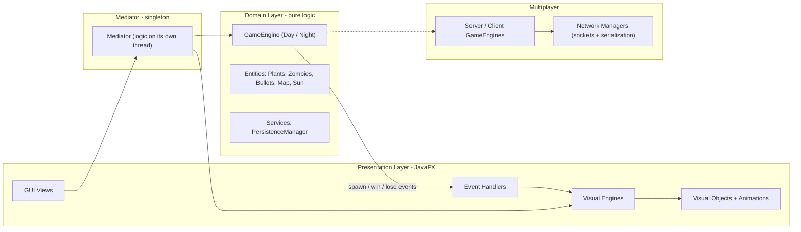

<div dir="rtl">

# 🌻 Plants vs. Zombies — نسخهٔ JavaFX

یک پیاده‌سازی کامل از بازی کلاسیک **Plants vs. Zombies**، ساخته‌شده از صفر با **Java 21** و **JavaFX**.
این پروژه فراتر از یک کلون سادهٔ بازیه: حول یک **معماری لایه‌ای و تمیز** طراحی شده که **منطق بازی را به‌طور کامل از رندر گرافیکی جدا می‌کند**، و علاوه بر آن یک **حالت چندنفرهٔ شبکه‌ای (Multiplayer)**، سیستم **ذخیره/بارگذاری**، و دو حالت بازی **روز و شب** دارد.

> پروژهٔ پایانی درس **برنامه‌نویسی پیشرفته** در **دانشگاه فردوسی مشهد (FUM)**.


---

## ✨ نکات برجسته

چیزهایی که این پروژه را از یک بازی دانشجویی معمولی متمایز می‌کند:

- **جداسازی کامل منطق از رندر.** لایهٔ `Domain` فقط **منطق خالص بازی** را دارد و هیچ اطلاعی از نحوهٔ کشیده‌شدن چیزها ندارد. لایهٔ `Presentation` (با JavaFX) فقط رندر می‌کند. یک **Mediator** این دو را به هم وصل می‌کند.
- **ارتباط رویدادمحور.** به‌جای اینکه منطق مستقیماً رابط کاربری را صدا بزند، دامین **رویداد منتشر می‌کند** (ساخت / برد / باخت / حذف) و لایهٔ نمایش **مشترک آن رویدادها می‌شود** — یک طراحی تمیز Observer / pub-sub.
- **حلقهٔ بازی روی یک ترد جداگانه** و با نرخ فریم ثابت اجرا می‌شود، مستقل از ترد رندر JavaFX، با استفاده از مجموعه‌های thread-safe و تحویل درست کار به ترد رابط کاربری.
- **چندنفرهٔ شبکه‌ای** با مدل client–server که در آن سرور مرجع اصلی بازی است.
- **ماندگاری (Persistence)** با Serialization جاوا (ذخیره و ادامهٔ بازی).
- حدود **۱۴۵ کلاس** که در سلسله‌مراتب‌های تمیز و تک‌مسئولیتی از کلاس‌های Abstract سازمان‌دهی شده‌اند.

---

## 🎮 امکانات بازی

- **دو حالت تک‌نفره:**
  - ☀️ **روز** — همان دفاع کلاسیک از چمن.
  - 🌙 **شب** — شامل **مه**، **قبر**، و **گیاهان خوابیده (قارچی)** که باید با `CoffeeBean` بیدار شوند.
- **اقتصاد خورشید** — جمع‌آوری خورشید (از آسمان و از Sunflower) برای خرید گیاه.
- زمین **۵ در ۹** با تشخیص برخورد بین گلوله‌ها، گیاهان و زامبی‌ها.
- شرایط **برد / باخت** با مدیریت کامل وضعیت بازی.
- **ذخیره و ادامهٔ** یک بازی نیمه‌تمام.
- **بازی چندنفرهٔ آنلاین** (میزبانی / پیوستن در شبکهٔ محلی).
- مجموعهٔ بزرگی از گیاهان، زامبی‌ها و گلوله‌ها.

> ⚠️ **نکته دربارهٔ فایل‌های گرافیکی:** تصاویر و صداها عمداً در ریپازیتوری قرار **داده نشده‌اند** (پوشهٔ `resources/` در `.gitignore` است). برای اجرای بازی با تصاویر، فایل‌های گرافیکی/صوتی را زیر `src/main/resources/` و مطابق مسیرهایی که در `GlobalSettings.getResource(...)` استفاده شده (مثل `graphics/Items/...`، صداها و …) قرار دهید.

---

## 🏛 معماری

پروژه از یک **معماری لایه‌ای (تمیز)** پیروی می‌کند. ایدهٔ اصلی: **دامین هیچ‌وقت مستقیم با JavaFX حرف نمی‌زند.** این دو طرف فقط از طریق **Mediator** و یک سازوکار **رویداد/مشترک** با هم ارتباط دارند.



**جریان یک تیک از بازی:**

۱. **Mediator** روی یک ترد پس‌زمینه (با `FPS = 30`) موتور بازی (`GameEngine`) را جلو می‌برد.
۲. موتور، وضعیت خالص بازی را به‌روز می‌کند (حرکت، حمله، خورشید، موج‌ها و …).
۳. هر وقت چیزی ساخته یا حذف شود، موتور **به مشترک‌هایش خبر می‌دهد** (`IEventSubscriber._notify(...)`).
۴. لایهٔ **Presentation** به این رویدادها واکنش نشان می‌دهد و **شیء گرافیکی** متناظر را روی ترد JavaFX می‌سازد یا به‌روز می‌کند.

یعنی کل بازی در اصل می‌تواند **بدون رابط گرافیکی (headless)** هم اجرا شود — و **سرور** در حالت چندنفره دقیقاً همین‌طور کار می‌کند.

---

## 🧩 دیزاین‌پترن‌های استفاده‌شده

- **Layered / Clean Architecture** — پکیج‌های `Domain` و `Presentation` جدا؛ منطقْ تست‌پذیر و قابل‌استفادهٔ مجدد، رابط کاربری قابل‌تعویض.
- **Mediator** — کلاس `Mediator` (سینگلتون): تنها نقطهٔ هماهنگی بین موتور منطق و موتور گرافیک.
- **Observer / Pub-Sub** — `IEventSubscriber` و مشترک‌های spawn / win / lose / dispose: جداکردن دامین از UI.
- **Template Method + Polymorphism** — `AbstractGameObject`، `AbstractPlantGameObject`، `AbstractZombieGameObject`، `AbstractVisualObject`: رفتار مشترک در کلاس پایه، جزئیات در زیرکلاس‌ها.
- **Factory Method** — مثل `createNormalZombieGameObject(...)` و `createGraveGameObject(...)`: ساخت متمرکز و یکدست اشیاء.
- **Singleton** — `Mediator` و تنظیمات سراسری.
- **سلسله‌مراتب موازی اشیاء** — هر `XxxGameObject` (منطق) یک `XxxVisualObject` (گرافیک) متناظر دارد؛ آینهٔ هم ولی مستقل.

**طراحی هم‌زمانی:** ترد منطق و ترد JavaFX وضعیت مشترک را به‌شکل امن با `CopyOnWriteArrayList` به اشتراک می‌گذارند، و هر تغییر روی UI که از ترد منطق می‌آید با `Platform.runLater(...)` به ترد رابط کاربری منتقل می‌شود.

---

## 📁 ساختار پروژه

```
src/main/java/com/pvz/plantsvszombies/
├── Domain/                  # منطق خالص بازی — بدون رندر JavaFX
│   ├── Common/              # Coordinate, GameMode
│   ├── Interfaces/          # GameEngine, IDisposable, IEventSubscriber
│   ├── Engines/             # DayEngine, NightEngine
│   ├── Services/            # PersistenceManager
│   └── Entities/            # AbstractGameObject + همهٔ موجودیت‌ها
│       ├── Plants/          # Peashooter, SunFlower, WallNut, ...
│       ├── Zombies/         # Normal, ConeHead, Imp, ScreenDoor
│       ├── Bullets/         # Normal, Snow, Shroom
│       └── Events/          # رویدادهای ساخت (sun, plant, map, ...)
│
├── Presentation/            # لایهٔ رندر با JavaFX
│   ├── Entities/            # آینهٔ گرافیکی هر موجودیت دامین
│   ├── Animations/          # انیمیشن هر گیاه / زامبی
│   ├── Engines/             # VisualEngine (+ Day / Night / Multiplayer)
│   ├── EventHandlers/       # تبدیل رویدادهای دامین به گرافیک
│   ├── Common/              # GridCoordinate
│   └── GUI/                 # MainApp + Views
│
├── Multiplayer/             # بازی شبکه‌ای
│   ├── Engines/             # ServerGameEngine, ClientGameEngine
│   ├── Network/             # NetworkManager (Server / Client)
│   └── Events/              # GameStart, ZombieSpawn, SunDrop, ...
│
├── Mediator/                # پل منطق و رندر
├── GlobalMusicSettings/     # SoundManager, SoundType
└── GlobalSettings.java      # اندازهٔ پنجره، FPS، بارگذاری منابع
```

---

## 🛠 تکنولوژی‌ها

- **زبان:** Java 21 (با سیستم ماژول جاوا — `module-info.java`)
- **رابط کاربری:** JavaFX 17 (`controls`, `fxml`, `media`) + ControlsFX، FormsFX، BootstrapFX
- **Serialization:** سریال‌سازی بومی جاوا (فایل ذخیره) + Jackson (برای JSON)
- **بیلد:** Maven (همراه با Maven Wrapper)
- **تست:** JUnit 5

---

## 🚀 نحوهٔ اجرا

**پیش‌نیازها:** نصب `JDK 21` (یا جدیدتر)، و قرار دادن فایل‌های گرافیکی زیر `src/main/resources/` (به نکتهٔ assetها در بالا نگاه کنید). برای Maven می‌توانید از wrapper موجود استفاده کنید و نیازی به نصب جدا نیست.

اجرا با Maven Wrapper (پیشنهادی):

```bash
# Linux / macOS
./mvnw clean javafx:run

# Windows
mvnw.cmd clean javafx:run
```

یا با Maven نصب‌شده روی سیستم:

```bash
mvn clean javafx:run
```

نقطهٔ ورود از قبل تنظیم شده است: `com.pvz.plantsvszombies.Presentation.GUI.MainApp`.

---

## 🌐 حالت چندنفره

حالت چندنفره از مدل **client–server با سرور مرجع** استفاده می‌کند: یک بازیکن میزبانی می‌کند (سرور صاحب وضعیت بازی و موج‌های زامبی است) و بقیه به‌عنوان کلاینت می‌پیوندند.

- **پورت پیش‌فرض:** `12345`
- **تعداد بازیکن:** ۲ تا ۴
- **انتقال داده:** سریال‌سازی اشیاء جاوا روی سوکت TCP
- **جریان کار:** کلاینت‌ها وصل می‌شوند → هرکدام **۶ گیاه** انتخاب و سیگنال *آماده* می‌فرستد → وقتی همه آماده شدند سرور بازی را شروع می‌کند → سرور رویدادها (`ZombieSpawn`، `SunDrop`، `WaveChange`، `GameEnd`) را پخش می‌کند و کلاینت‌ها وضعیت محلی‌شان را به‌روز می‌کنند.

توضیح کامل (ترتیب رویدادها، انواع رویداد، مسئولیت سرور/کلاینت) در فایل `MULTIPLAYER_DOCUMENTATION.md` آمده است.

---

## 💾 ذخیره و بارگذاری

وضعیت بازی از طریق `PersistenceManager` ماندگار می‌شود؛ این کلاس فهرست اشیاء فعال `AbstractGameObject` را در فایل `save.dat` سریال‌سازی می‌کند و هنگام بارگذاری بازمی‌گرداند. هر موجودیت `Serializable` است و فیلدهای transient (مثل ارجاع به موتور و مشترک‌های رویداد) بعد از deserialize دوباره ساخته می‌شوند.

---

## 🌱 کاتالوگ گیاهان و زامبی‌ها

**گیاهان** (هرکدام یک کلاس `*GameObject` در `Domain/Entities/Plants`):

- **حمله‌ای:** Peashooter، Repeater، Snow Pea
- **دفاعی:** Wall-nut، Tall-nut
- **خورشید:** Sunflower
- **قارچی (شب):** Puff-shroom، Scaredy-shroom، Ice-shroom، Hypno-shroom
- **آنی / ویژه:** Cherry Bomb، Jalapeno، Doom-shroom، Blover، Plantern، Grave Buster، Coffee Bean

**زامبی‌ها:** Normal، Cone-head، Imp، Screen-door — به‌علاوهٔ زامبی **هیپنوتیزم‌شده** (وقتی Hypno-shroom یک دشمن را برمی‌گرداند ساخته می‌شود).

**گلوله‌ها:** Normal pea، Snow pea (کندکننده)، Shroom bullet.

---

## 🔭 بهبودهای ممکن

- خارج‌کردن چند ارجاع باقی‌ماندهٔ JavaFX از دامین برای رسیدن به یک هستهٔ کاملاً headless.
- یک لابی واقعی برای چندنفره + مدیریت اتصال مجدد.
- همگام‌سازی کامل وضعیت بازی (به‌جای بازپخش رویداد) برای کلاینت‌هایی که دیر می‌پیوندند.
- پوشش تست واحد برای منطق موتور.

---

## 👤 سازنده

**یحیی محمدزاده** — مهندسی کامپیوتر، دانشگاه فردوسی مشهد
yahyamoha06@gmail.com · https://github.com/yahya-mz

</div>
