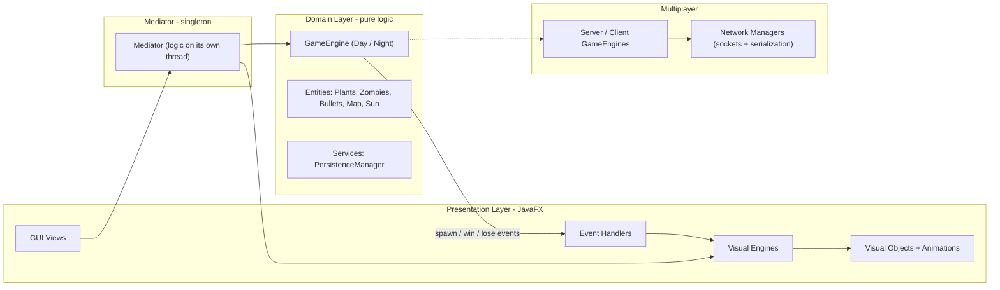

<div dir="rtl">

# Plants vs. Zombies — نسخهٔ JavaFX 🌻

یک پیاده‌سازی کامل از بازی کلاسیک **Plants vs. Zombies**، ساخته‌شده از صفر با **Java 21** و **JavaFX**.
این پروژه فراتر از یک کلون سادهٔ بازیه: حول یک **معماری لایه‌ای و تمیز** طراحی شده که منطق بازی را به‌طور کامل از رندر گرافیکی جدا می‌کند، و علاوه بر آن یک **حالت چندنفرهٔ شبکه‌ای**، سیستم **ذخیره و بارگذاری**، و دو حالت بازی **روز و شب** دارد.

> پروژهٔ پایانی درس **برنامه‌نویسی پیشرفته** در **دانشگاه فردوسی مشهد (FUM)**.


---

## ✨ نکات برجسته

چیزهایی که این پروژه را از یک بازی دانشجویی معمولی متمایز می‌کند:

- **جداسازی کامل منطق از رندر.** لایهٔ منطق فقط منطق خالص بازی را دارد و هیچ اطلاعی از نحوهٔ کشیده‌شدن چیزها ندارد. لایهٔ گرافیکی فقط رندر می‌کند. یک Mediator این دو را به هم وصل می‌کند.
- **ارتباط رویدادمحور.** به‌جای اینکه منطق مستقیماً رابط کاربری را صدا بزند، دامین رویداد منتشر می‌کند و لایهٔ نمایش مشترک آن رویدادها می‌شود؛ یک طراحی تمیز از نوع Observer و Pub-Sub.
- **حلقهٔ بازی روی یک ترد جداگانه** و با نرخ فریم ثابت اجرا می‌شود، مستقل از ترد رندر، با استفاده از مجموعه‌های امن در برابر هم‌زمانی.
- **چندنفرهٔ شبکه‌ای** با مدل کلاینت-سرور که در آن سرور مرجع اصلی بازی است.
- **ماندگاری داده** با Serialization جاوا برای ذخیره و ادامهٔ بازی.
- حدود **۱۴۵ کلاس** که در سلسله‌مراتب‌های تمیز و تک‌مسئولیتی از کلاس‌های انتزاعی سازمان‌دهی شده‌اند.

---

## 🎮 امکانات بازی

- **دو حالت تک‌نفره.** حالت روز همان دفاع کلاسیک از چمن است؛ حالت شب مه، قبر و گیاهان خوابیدهٔ قارچی را اضافه می‌کند که باید با گیاه قهوه بیدار شوند.
- **اقتصاد خورشید.** برای خرید گیاه باید خورشید جمع کنید (از آسمان و از آفتابگردان).
- **زمین پنج در نُه** با تشخیص برخورد بین گلوله‌ها، گیاهان و زامبی‌ها.
- شرایط **برد و باخت** با مدیریت کامل وضعیت بازی.
- **ذخیره و ادامهٔ** یک بازی نیمه‌تمام.
- **بازی چندنفرهٔ آنلاین** برای میزبانی یا پیوستن در شبکهٔ محلی.
- مجموعهٔ بزرگی از گیاهان، زامبی‌ها و گلوله‌ها.

> ⚠️ **نکته دربارهٔ فایل‌های گرافیکی:** تصاویر و صداها عمداً در ریپازیتوری قرار داده نشده‌اند (پوشهٔ منابع در فایل گیت‌ایگنور است). برای اجرای بازی با تصاویر، فایل‌های گرافیکی و صوتی را زیر مسیر منابع پروژه قرار دهید.

---

## 🏛 معماری

پروژه از یک معماری لایه‌ای و تمیز پیروی می‌کند. ایدهٔ اصلی این است که دامین هیچ‌وقت مستقیم با JavaFX حرف نمی‌زند؛ این دو طرف فقط از طریق Mediator و یک سازوکار رویداد و مشترک با هم ارتباط دارند.



**جریان یک تیک از بازی به این صورت است:**

1. مدیاتور موتور بازی را روی یک ترد پس‌زمینه و با نرخ سی فریم بر ثانیه جلو می‌برد.
2. موتور، وضعیت خالص بازی را به‌روز می‌کند؛ شامل حرکت، حمله، خورشید و موج‌ها.
3. هر وقت چیزی ساخته یا حذف شود، موتور به مشترک‌هایش خبر می‌دهد.
4. لایهٔ گرافیکی به این رویدادها واکنش نشان می‌دهد و شیء گرافیکی متناظر را روی ترد JavaFX می‌سازد یا به‌روز می‌کند.

یعنی کل بازی در اصل می‌تواند بدون رابط گرافیکی هم اجرا شود، و سرور در حالت چندنفره دقیقاً همین‌طور کار می‌کند.

---

## 🧩 دیزاین‌پترن‌های استفاده‌شده

- **معماری لایه‌ای و تمیز.** پکیج منطق و پکیج گرافیک از هم جدا هستند؛ منطقْ تست‌پذیر و قابل‌استفادهٔ مجدد است و رابط کاربری قابل‌تعویض.
- **الگوی Mediator.** یک کلاس سینگلتون که تنها نقطهٔ هماهنگی بین موتور منطق و موتور گرافیک است.
- **الگوی Observer و Pub-Sub.** دامین رویداد می‌فرستد و لایهٔ نمایش مشترک می‌شود؛ این کار دامین را از رابط کاربری جدا می‌کند.
- **الگوی Template Method و چندریختی.** کلاس‌های انتزاعی پایه رفتار مشترک را نگه می‌دارند و زیرکلاس‌ها جزئیات هر گیاه و زامبی را پیاده می‌کنند.
- **الگوی Factory Method.** ساخت اشیاء به‌صورت متمرکز و یکدست از طریق متدهای سازنده انجام می‌شود.
- **الگوی Singleton.** برای مدیاتور و تنظیمات سراسری.
- **سلسله‌مراتب موازی اشیاء.** هر شیء منطقی یک شیء گرافیکی متناظر دارد؛ آینهٔ هم ولی مستقل از هم.

**طراحی هم‌زمانی:** ترد منطق و ترد گرافیک وضعیت مشترک را به‌شکل امن از طریق یک لیست امن در برابر هم‌زمانی به اشتراک می‌گذارند، و هر تغییری که از ترد منطق روی رابط کاربری اعمال می‌شود، به‌درستی به ترد گرافیک منتقل می‌شود.

---

## 📁 ساختار پروژه

```
src/main/java/com/pvz/plantsvszombies/
├── Domain/                  # منطق خالص بازی، بدون رندر
│   ├── Common/              # Coordinate, GameMode
│   ├── Interfaces/          # GameEngine, IDisposable, IEventSubscriber
│   ├── Engines/             # DayEngine, NightEngine
│   ├── Services/            # PersistenceManager
│   └── Entities/            # AbstractGameObject + entities
│       ├── Plants/          # Peashooter, SunFlower, WallNut, ...
│       ├── Zombies/         # Normal, ConeHead, Imp, ScreenDoor
│       ├── Bullets/         # Normal, Snow, Shroom
│       └── Events/          # spawn events
│
├── Presentation/            # layer JavaFX
│   ├── Entities/            # visual mirror of domain entities
│   ├── Animations/          # per-plant / per-zombie animations
│   ├── Engines/             # VisualEngine + Day/Night/Multiplayer
│   ├── EventHandlers/       # domain events -> visuals
│   ├── Common/              # GridCoordinate
│   └── GUI/                 # MainApp + Views
│
├── Multiplayer/             # networked play
│   ├── Engines/             # ServerGameEngine, ClientGameEngine
│   ├── Network/             # NetworkManager (Server / Client)
│   └── Events/              # GameStart, ZombieSpawn, SunDrop, ...
│
├── Mediator/                # logic <-> render bridge
├── GlobalMusicSettings/     # SoundManager, SoundType
└── GlobalSettings.java      # window size, FPS, resources
```

---

## 🛠 تکنولوژی‌ها

- **زبان:** جاوا ۲۱ همراه با سیستم ماژول جاوا.
- **رابط کاربری:** JavaFX نسخهٔ ۱۷ به‌همراه کتابخانه‌های ControlsFX و FormsFX و BootstrapFX.
- **سریال‌سازی:** سریال‌سازی بومی جاوا برای فایل ذخیره، و Jackson برای JSON.
- **بیلد:** Maven همراه با Maven Wrapper.
- **تست:** JUnit نسخهٔ ۵.

---

## 🚀 نحوهٔ اجرا

**پیش‌نیازها:** نصب جاوا ۲۱ یا جدیدتر، و قرار دادن فایل‌های گرافیکی زیر مسیر منابع پروژه. برای ساخت پروژه می‌توانید از Maven Wrapper موجود استفاده کنید و نیازی به نصب جدا نیست.

اجرا با Maven Wrapper (پیشنهادی):

```bash
# Linux / macOS
./mvnw clean javafx:run

# Windows
mvnw.cmd clean javafx:run
```

یا با Maven نصب‌شده روی سیستم:

```bash
mvn clean javafx:run
```

نقطهٔ ورود برنامه از قبل تنظیم شده است:

```
com.pvz.plantsvszombies.Presentation.GUI.MainApp
```

---

## 🌐 حالت چندنفره

حالت چندنفره از مدل کلاینت-سرور با سرور مرجع استفاده می‌کند: یک بازیکن میزبانی می‌کند و سرور صاحب وضعیت بازی و موج‌های زامبی است، و بقیه به‌عنوان کلاینت می‌پیوندند.

- **پورت پیش‌فرض:** عدد ۱۲۳۴۵
- **تعداد بازیکن:** بین ۲ تا ۴ نفر
- **انتقال داده:** سریال‌سازی اشیاء جاوا روی سوکت TCP

**جریان کار به این صورت است:** ابتدا کلاینت‌ها وصل می‌شوند و هرکدام شش گیاه انتخاب کرده و سیگنال آماده می‌فرستد. وقتی همهٔ کلاینت‌ها آماده شدند، سرور بازی را شروع می‌کند و رویدادهای بازی را برای همه پخش می‌کند تا وضعیت محلی هر کلاینت به‌روز شود.

توضیح کامل این بخش در فایل مستندات مولتی‌پلیر (MULTIPLAYER_DOCUMENTATION) آمده است.

---

## 💾 ذخیره و بارگذاری

وضعیت بازی از طریق کلاس مدیریت ماندگاری ذخیره می‌شود؛ این کلاس فهرست اشیاء فعال بازی را در یک فایل ذخیره سریال‌سازی می‌کند و هنگام بارگذاری بازمی‌گرداند. هر موجودیت قابلیت سریال‌سازی دارد و فیلدهای موقتی آن، مانند ارجاع به موتور و مشترک‌های رویداد، بعد از بازخوانی دوباره ساخته می‌شوند.

---

## 🌱 کاتالوگ گیاهان و زامبی‌ها

**گیاهان:**

- **حمله‌ای:** Peashooter و Repeater و Snow Pea
- **دفاعی:** Wall-nut و Tall-nut
- **خورشید:** Sunflower
- **قارچی برای شب:** Puff-shroom و Scaredy-shroom و Ice-shroom و Hypno-shroom
- **آنی و ویژه:** Cherry Bomb و Jalapeno و Doom-shroom و Blover و Plantern و Grave Buster و Coffee Bean

**زامبی‌ها:** Normal و Cone-head و Imp و Screen-door، به‌علاوهٔ زامبی هیپنوتیزم‌شده که وقتی گیاه هیپنو یک دشمن را برمی‌گرداند ساخته می‌شود.

**گلوله‌ها:** گلولهٔ معمولی، گلولهٔ برفی (کندکننده) و گلولهٔ قارچی.

---

## 🔭 بهبودهای ممکن

- خارج‌کردن چند ارجاع باقی‌ماندهٔ JavaFX از دامین برای رسیدن به یک هستهٔ کاملاً مستقل از گرافیک.
- یک لابی واقعی برای حالت چندنفره به‌همراه مدیریت اتصال مجدد.
- همگام‌سازی کامل وضعیت بازی برای کلاینت‌هایی که دیر می‌پیوندند.
- افزودن تست واحد برای منطق موتور بازی.

---

## 👤 سازنده

**یحیی محمدزاده** — مهندسی کامپیوتر، دانشگاه فردوسی مشهد

yahyamoha06@gmail.com

https://github.com/yahya-mz

</div>
