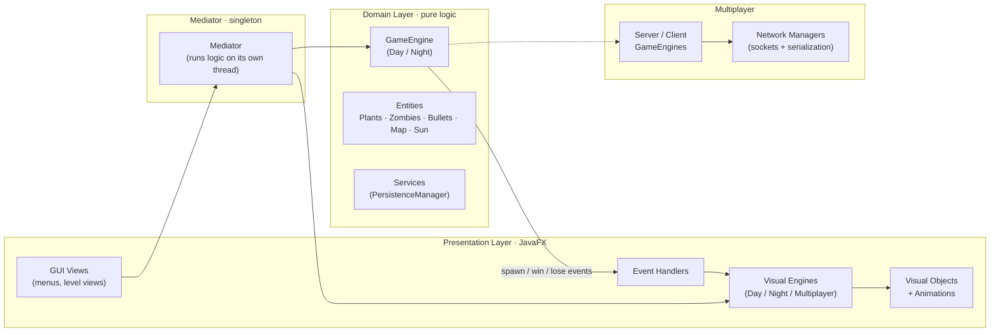

<div dir="rtl">

# 🌻 پلنتس ورژز زامبیز — نسخهٔ JavaFX

یک پیاده‌سازی کامل از بازی کلاسیک **Plants vs. Zombies**، ساخته‌شده از صفر با **Java 21** و **JavaFX**.
این پروژه فراتر از یک کلون سادهٔ بازیه: حول یک **معماری لایه‌ای و تمیز** طراحی شده که **منطق بازی را به‌طور کامل از رندر گرافیکی جدا می‌کند**، و علاوه بر آن یک **حالت چندنفرهٔ شبکه‌ای (Multiplayer)**، سیستم **ذخیره/بارگذاری**، و دو حالت بازی **روز و شب** دارد.

> پروژهٔ پایانی درس **برنامه‌نویسی پیشرفته** در **دانشگاه فردوسی مشهد (FUM)**.

<p dir="ltr">
  
  
  
  
</p>

---

## 📖 فهرست
- [نکات برجسته](#-نکات-برجسته)
- [امکانات بازی](#-امکانات-بازی)
- [معماری](#-معماری)
- [دیزاین‌پترن‌های استفاده‌شده](#-دیزاینپترنهای-استفادهشده)
- [ساختار پروژه](#-ساختار-پروژه)
- [تکنولوژی‌ها](#-تکنولوژیها)
- [نحوهٔ اجرا](#-نحوهٔ-اجرا)
- [حالت چندنفره](#-حالت-چندنفره)
- [ذخیره و بارگذاری](#-ذخیره-و-بارگذاری)
- [کاتالوگ گیاهان و زامبی‌ها](#-کاتالوگ-گیاهان-و-زامبیها)
- [بهبودهای ممکن](#-بهبودهای-ممکن)

---

## ✨ نکات برجسته

چیزهایی که این پروژه را از یک بازی دانشجویی معمولی متمایز می‌کند:

- **جداسازی کامل منطق از رندر.** لایهٔ `Domain` فقط **منطق خالص بازی** را دارد و هیچ اطلاعی از نحوهٔ کشیده‌شدن چیزها ندارد. لایهٔ `Presentation` (با JavaFX) فقط رندر می‌کند. یک **Mediator** این دو را به هم وصل می‌کند.
- **ارتباط رویدادمحور.** به‌جای اینکه منطق مستقیماً رابط کاربری را صدا بزند، دامین **رویداد منتشر می‌کند** (ساخت / برد / باخت / حذف) و لایهٔ نمایش **مشترک آن رویدادها می‌شود** — یک طراحی تمیز Observer / pub-sub.
- **حلقهٔ بازی روی یک ترد جداگانه** و با نرخ فریم ثابت اجرا می‌شود، مستقل از ترد رندر JavaFX، با استفاده از مجموعه‌های thread-safe و تحویل درست کار به ترد رابط کاربری.
- **چندنفرهٔ شبکه‌ای** با مدل client–server که در آن سرور مرجع اصلی بازی است.
- **ماندگاری (Persistence)** با Serialization جاوا (ذخیره و ادامهٔ بازی).
- حدود **۱۴۵ کلاس** که در سلسله‌مراتب‌های تمیز و تک‌مسئولیتی از کلاس‌های Abstract سازمان‌دهی شده‌اند.

---

## 🎮 امکانات بازی

- **دو حالت تک‌نفره:**
  - ☀️ **روز** — همان دفاع کلاسیک از چمن.
  - 🌙 **شب** — شامل **مه**، **قبر**، و **گیاهان خوابیده (قارچی)** که باید با **Coffee Bean** بیدار شوند.
- **اقتصاد خورشید** — جمع‌آوری خورشید (از آسمان و از Sunflower) برای خرید گیاه.
- زمین **۵ در ۹** با تشخیص برخورد بین گلوله‌ها، گیاهان و زامبی‌ها.
- شرایط **برد / باخت** با مدیریت کامل وضعیت بازی.
- **ذخیره و ادامهٔ** یک بازی نیمه‌تمام.
- **بازی چندنفرهٔ آنلاین** (میزبانی / پیوستن در شبکهٔ محلی).
- مجموعهٔ بزرگی از گیاهان، زامبی‌ها و گلوله‌ها (به [کاتالوگ](#-کاتالوگ-گیاهان-و-زامبیها) نگاه کنید).

> ⚠️ **نکته دربارهٔ فایل‌های گرافیکی:** تصاویر و صداها عمداً در ریپازیتوری قرار **داده نشده‌اند** (پوشهٔ `resources/` در `.gitignore` است). برای اجرای بازی با تصاویر، فایل‌های گرافیکی/صوتی را زیر `src/main/resources/` و مطابق مسیرهایی که در `GlobalSettings.getResource(...)` استفاده شده (مثل `graphics/Items/...`، صداها و …) قرار دهید.

---

## 🏛 معماری

پروژه از یک **معماری لایه‌ای (تمیز)** پیروی می‌کند. ایدهٔ اصلی: **دامین هیچ‌وقت مستقیم با JavaFX حرف نمی‌زند.** این دو طرف فقط از طریق **Mediator** و یک سازوکار **رویداد/مشترک** با هم ارتباط دارند.

<div dir="ltr">



</div>

**جریان یک تیک از بازی:**
1. **Mediator** روی یک ترد پس‌زمینه (با `FPS = 30`) موتور بازی (`GameEngine`) را جلو می‌برد.
2. موتور، وضعیت خالص بازی را به‌روز می‌کند (حرکت، حمله، خورشید، موج‌ها و …).
3. هر وقت چیزی ساخته یا حذف شود، موتور **به مشترک‌هایش خبر می‌دهد** (`IEventSubscriber._notify(...)`).
4. لایهٔ **Presentation** به این رویدادها واکنش نشان می‌دهد و **شیء گرافیکی** متناظر را روی ترد JavaFX می‌سازد یا به‌روز می‌کند.

یعنی کل بازی در اصل می‌تواند **بدون رابط گرافیکی (headless)** هم اجرا شود — و **سرور** در حالت چندنفره دقیقاً همین‌طور کار می‌کند.

---

## 🧩 دیزاین‌پترن‌های استفاده‌شده

<div dir="ltr">

| Pattern | کجا استفاده شده | چرا |
|---|---|---|
| **Layered / Clean Architecture** | پکیج‌های `Domain` و `Presentation` | منطق تست‌پذیر و قابل‌استفادهٔ مجدد؛ رابط کاربری قابل‌تعویض |
| **Mediator** | کلاس `Mediator` (سینگلتون) | تنها نقطهٔ هماهنگی بین موتور منطق و موتور گرافیک |
| **Observer / Pub-Sub** | `IEventSubscriber`، مشترک‌های spawn / win / lose / dispose | جداکردن دامین از رابط کاربری؛ دامین رویداد می‌فرستد، UI گوش می‌دهد |
| **Template Method + Polymorphism** | `AbstractGameObject`, `AbstractPlantGameObject`, `AbstractZombieGameObject`, `AbstractVisualObject` | رفتار مشترک در کلاس پایه، جزئیات در زیرکلاس‌ها |
| **Factory Method** | `createNormalZombieGameObject(...)`, `createGraveGameObject(...)` و … | ساخت متمرکز و یکدست اشیاء |
| **Singleton** | `Mediator`، تنظیمات سراسری | یک نمونهٔ مرجع |
| **سلسله‌مراتب موازی اشیاء** | هر `XxxGameObject` (منطق) یک `XxxVisualObject` (گرافیک) متناظر دارد | منطق و رندر آینهٔ هم ولی مستقل از هم |

</div>

**طراحی هم‌زمانی:** ترد منطق و ترد JavaFX وضعیت مشترک را به‌شکل امن از طریق `CopyOnWriteArrayList` به اشتراک می‌گذارند، و هر تغییر روی UI که از ترد منطق می‌آید با `Platform.runLater(...)` به ترد رابط کاربری منتقل می‌شود.

---

## 📁 ساختار پروژه

<div dir="ltr">

```
src/main/java/com/pvz/plantsvszombies/
├── Domain/                  # منطق خالص بازی — بدون رندر JavaFX
│   ├── Common/              # Coordinate, GameMode
│   ├── Interfaces/          # GameEngine, IDisposable, IEventSubscriber
│   ├── Engines/             # DayEngine, NightEngine
│   ├── Services/            # PersistenceManager (ذخیره / بارگذاری)
│   └── Entities/            # AbstractGameObject + همهٔ موجودیت‌های بازی
│       ├── Plants/          # Peashooter, SunFlower, WallNut, ...
│       ├── Zombies/         # Normal, ConeHead, Imp, ScreenDoor
│       ├── Bullets/         # Normal, Snow, Shroom
│       └── Events/          # رویدادهای ساخت (sun, plant, map, ...)
│
├── Presentation/            # لایهٔ رندر با JavaFX
│   ├── Entities/            # آینهٔ گرافیکی هر موجودیت دامین
│   ├── Animations/          # انیمیشن هر گیاه / زامبی
│   ├── Engines/             # VisualEngine (+ Day / Night / Multiplayer)
│   ├── EventHandlers/       # تبدیل رویدادهای دامین → گرافیک
│   ├── Common/              # GridCoordinate
│   └── GUI/                 # MainApp + Views (منوها، صفحات بازی)
│
├── Multiplayer/             # بازی شبکه‌ای
│   ├── Engines/             # ServerGameEngine, ClientGameEngine
│   ├── Network/             # NetworkManager (Server / Client)
│   └── Events/              # GameStart, ZombieSpawn, SunDrop, ...
│
├── Mediator/                # پل منطق ⇄ رندر
├── GlobalMusicSettings/     # SoundManager, SoundType
└── GlobalSettings.java      # اندازهٔ پنجره، FPS، بارگذاری منابع
```

</div>

---

## 🛠 تکنولوژی‌ها

- **زبان:** Java 21 (با سیستم ماژول جاوا — `module-info.java`)
- **رابط کاربری:** JavaFX 17 (`controls`, `fxml`, `media`) به‌علاوهٔ ControlsFX، FormsFX، BootstrapFX
- **Serialization:** سریال‌سازی بومی جاوا (فایل‌های ذخیره) + Jackson (برای JSON)
- **بیلد:** Maven (همراه با Maven Wrapper)
- **تست:** JUnit 5

---

## 🚀 نحوهٔ اجرا

### پیش‌نیازها
- **JDK 21** (یا جدیدتر)
- **Maven** — یا استفاده از wrapper موجود (`mvnw` / `mvnw.cmd`)، بدون نیاز به نصب
- قرار دادن **فایل‌های گرافیکی** زیر `src/main/resources/` (به نکتهٔ assetها در بالا نگاه کنید)

### اجرا

با Maven Wrapper (پیشنهادی):

<div dir="ltr">

```bash
# Linux / macOS
./mvnw clean javafx:run

# Windows
mvnw.cmd clean javafx:run
```

</div>

یا با Maven نصب‌شده روی سیستم:

<div dir="ltr">

```bash
mvn clean javafx:run
```

</div>

پلاگین JavaFX از قبل تنظیم شده تا نقطهٔ ورود را اجرا کند:
`com.pvz.plantsvszombies.Presentation.GUI.MainApp`.

---

## 🌐 حالت چندنفره

حالت چندنفره از مدل **client–server با سرور مرجع** استفاده می‌کند: یک بازیکن میزبانی می‌کند (سرور صاحب وضعیت بازی و موج‌های زامبی است) و بقیه به‌عنوان کلاینت می‌پیوندند.

- **پورت پیش‌فرض:** `12345`
- **تعداد بازیکن:** ۲ تا ۴
- **انتقال داده:** سریال‌سازی اشیاء جاوا روی سوکت TCP
- **جریان کار:** کلاینت‌ها وصل می‌شوند → هرکدام **۶ گیاه** انتخاب و سیگنال *آماده* می‌فرستد → وقتی همه آماده شدند سرور بازی را شروع می‌کند → سرور رویدادها (`ZombieSpawn`، `SunDrop`، `WaveChange`، `GameEnd`) را پخش می‌کند و کلاینت‌ها وضعیت محلی‌شان را به‌روز می‌کنند.

📄 توضیح کامل (ترتیب رویدادها، انواع رویداد، مسئولیت سرور/کلاینت) در فایل **[`MULTIPLAYER_DOCUMENTATION.md`](./MULTIPLAYER_DOCUMENTATION.md)** آمده است.

---

## 💾 ذخیره و بارگذاری

وضعیت بازی از طریق `PersistenceManager` ماندگار می‌شود؛ این کلاس فهرست اشیاء فعال `AbstractGameObject` را در فایل `save.dat` سریال‌سازی می‌کند و هنگام بارگذاری بازمی‌گرداند. هر موجودیت `Serializable` است و فیلدهای transient (مثل ارجاع به موتور و مشترک‌های رویداد) بعد از deserialize دوباره ساخته می‌شوند.

---

## 🌱 کاتالوگ گیاهان و زامبی‌ها

**گیاهان** (هرکدام یک کلاس `*GameObject` در `Domain/Entities/Plants`):

<div dir="ltr">

| Offensive | Defensive | Sun / Utility | Night (mushrooms) | Instant / Special |
|---|---|---|---|---|
| Peashooter | Wall-nut | Sunflower | Puff-shroom | Cherry Bomb |
| Repeater | Tall-nut | — | Scaredy-shroom | Jalapeno |
| Snow Pea | — | — | Ice-shroom | Doom-shroom |
| — | — | — | Hypno-shroom | Blover |
| — | — | — | — | Plantern · Grave Buster · Coffee Bean |

</div>

**زامبی‌ها:** Normal · Cone-head · Imp · Screen-door — به‌علاوهٔ زامبی **هیپنوتیزم‌شده** (وقتی Hypno-shroom یک دشمن را برمی‌گرداند ساخته می‌شود).

**گلوله‌ها:** Normal pea · Snow pea (کندکننده) · Shroom bullet.

---

## 🔭 بهبودهای ممکن

- خارج‌کردن چند ارجاع باقی‌ماندهٔ JavaFX از دامین برای رسیدن به یک هستهٔ کاملاً headless.
- یک لابی واقعی برای چندنفره + مدیریت اتصال مجدد.
- همگام‌سازی کامل وضعیت بازی (به‌جای بازپخش رویداد) برای کلاینت‌هایی که دیر می‌پیوندند.
- پوشش تست واحد برای منطق موتور (معماری فعلی این کار را آسان کرده است).

---

## 👤 سازنده

**یحیی محمدزاده** — مهندسی کامپیوتر، دانشگاه فردوسی مشهد
📧 yahyamoha06@gmail.com · 🐙 <span dir="ltr">[github.com/yahya-mz](https://github.com/yahya-mz)</span>

</div>
